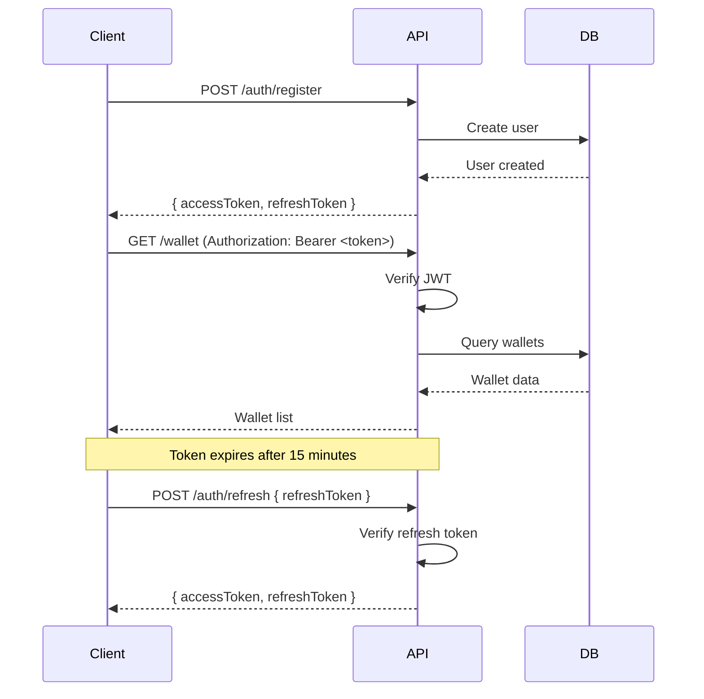
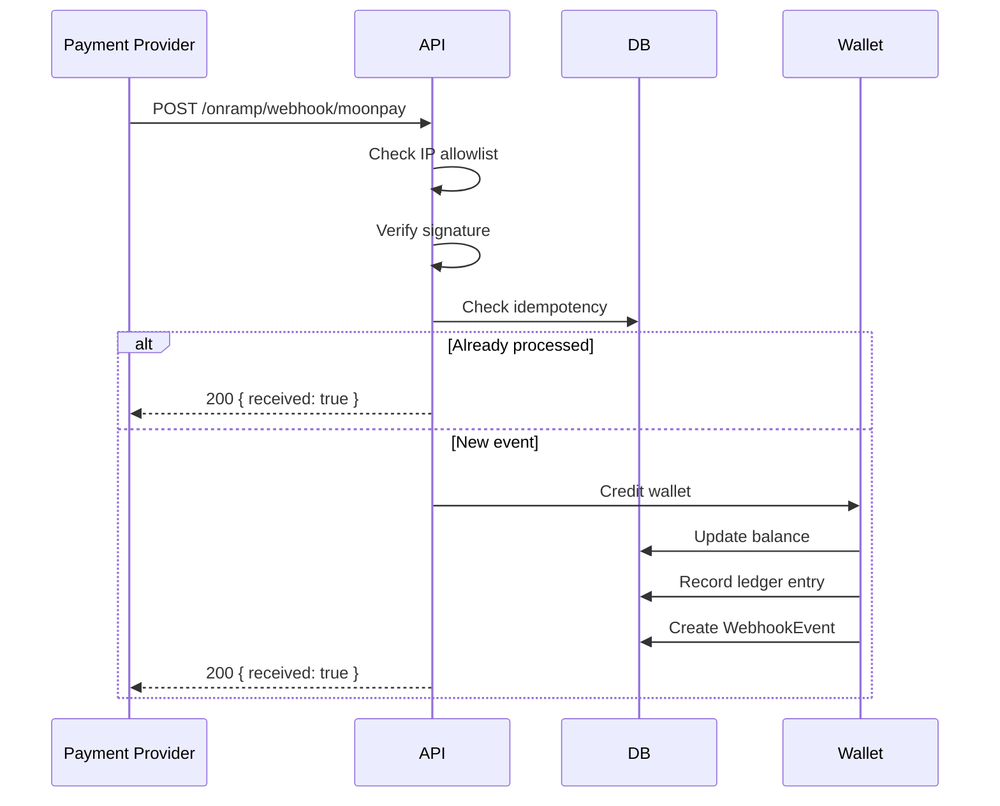

# API Reference

## Authentication

### Register User
```http
POST /auth/register
Content-Type: application/json

{
  "email": "user@example.com",
  "password": "secure_password",
  "name": "John Doe"
}
```

**Response (201):**
```json
{
  "user": {
    "id": "user_123",
    "email": "user@example.com",
    "name": "John Doe",
    "role": "USER"
  },
  "accessToken": "eyJhbGciOiJIUzI1NiIsInR5cCI6IkpXVCJ9...",
  "refreshToken": "eyJhbGciOiJIUzI1NiIsInR5cCI6IkpXVCJ9..."
}
```

**Rate Limit:** 5 requests/minute

---

### Login
```http
POST /auth/login
Content-Type: application/json

{
  "email": "user@example.com",
  "password": "secure_password"
}
```

**Response (200):**
```json
{
  "accessToken": "eyJhbGciOiJIUzI1NiIsInR5cCI6IkpXVCJ9...",
  "refreshToken": "eyJhbGciOiJIUzI1NiIsInR5cCI6IkpXVCJ9..."
}
```

**Rate Limit:** 5 requests/minute

---

### Refresh Token
```http
POST /auth/refresh
Content-Type: application/json

{
  "refreshToken": "eyJhbGciOiJIUzI1NiIsInR5cCI6IkpXVCJ9..."
}
```

**Response (200):**
```json
{
  "accessToken": "eyJhbGciOiJIUzI1NiIsInR5cCI6IkpXVCJ9...",
  "refreshToken": "eyJhbGciOiJIUzI1NiIsInR5cCI6IkpXVCJ9..."
}
```

**Rate Limit:** 5 requests/minute

---

## Wallets

All wallet endpoints require authentication. Include JWT token in header:
```http
Authorization: Bearer <accessToken>
```

### Create Wallet
```http
POST /wallet
Content-Type: application/json
Authorization: Bearer <token>

{
  "currency": "USD"
}
```

**Response (201):**
```json
{
  "id": "wallet_123",
  "userId": "user_123",
  "currency": "USD",
  "balance": 0,
  "createdAt": "2026-02-07T10:00:00.000Z",
  "frozenAt": null
}
```

**Rate Limit:** 10 requests/minute

---

### Get My Wallets
```http
GET /wallet
Authorization: Bearer <token>
```

**Response (200):**
```json
[
  {
    "id": "wallet_123",
    "userId": "user_123",
    "currency": "USD",
    "balance": 1000.50,
    "createdAt": "2026-02-07T10:00:00.000Z",
    "frozenAt": null
  }
]
```

**Rate Limit:** 30 requests/minute

---

### Get Wallet by ID
```http
GET /wallet/:id
Authorization: Bearer <token>
```

**Response (200):**
```json
{
  "id": "wallet_123",
  "userId": "user_123",
  "currency": "USD",
  "balance": 1000.50,
  "createdAt": "2026-02-07T10:00:00.000Z",
  "frozenAt": null
}
```

**Rate Limit:** 30 requests/minute

---

### Get Wallet Balance
```http
GET /wallet/:id/balance
Authorization: Bearer <token>
```

**Response (200):**
```json
{
  "balance": 1000.50,
  "currency": "USD"
}
```

**Rate Limit:** 30 requests/minute

---

### Get Wallet Ledger
```http
GET /wallet/:id/ledger?limit=50&offset=0
Authorization: Bearer <token>
```

**Response (200):**
```json
{
  "entries": [
    {
      "id": "entry_123",
      "walletId": "wallet_123",
      "type": "deposit",
      "amount": 100.00,
      "balanceBefore": 900.50,
      "balanceAfter": 1000.50,
      "reference": "onramp_moonpay_tx_456",
      "description": "MoonPay deposit",
      "createdAt": "2026-02-07T10:00:00.000Z"
    }
  ],
  "total": 1
}
```

**Rate Limit:** 30 requests/minute

---

## Transactions

### Get My Transactions
```http
GET /transaction?limit=50&offset=0
Authorization: Bearer <token>
```

**Response (200):**
```json
[
  {
    "id": "tx_123",
    "walletId": "wallet_123",
    "type": "deposit",
    "amount": 100.00,
    "status": "completed",
    "createdAt": "2026-02-07T10:00:00.000Z"
  }
]
```

**Rate Limit:** 20 requests/minute

---

### Get Transaction by ID
```http
GET /transaction/:id
Authorization: Bearer <token>
```

**Response (200):**
```json
{
  "id": "tx_123",
  "walletId": "wallet_123",
  "type": "deposit",
  "amount": 100.00,
  "status": "completed",
  "createdAt": "2026-02-07T10:00:00.000Z"
}
```

**Rate Limit:** 20 requests/minute

---

## On-Ramp (Fiat → Crypto)

### Initiate On-Ramp
```http
POST /onramp/initiate
Content-Type: application/json
Authorization: Bearer <token>

{
  "walletId": "wallet_123",
  "amount": 100.00,
  "currency": "USD",
  "provider": "moonpay"
}
```

**Response (201):**
```json
{
  "id": "onramp_123",
  "walletId": "wallet_123",
  "provider": "moonpay",
  "amount": 100.00,
  "currency": "USD",
  "status": "pending",
  "createdAt": "2026-02-07T10:00:00.000Z"
}
```

**Rate Limit:** 15 requests/minute

---

### Get On-Ramp Status
```http
GET /onramp/:id/status
Authorization: Bearer <token>
```

**Response (200):**
```json
{
  "id": "onramp_123",
  "walletId": "wallet_123",
  "provider": "moonpay",
  "amount": 100.00,
  "currency": "USD",
  "status": "completed",
  "createdAt": "2026-02-07T10:00:00.000Z",
  "completedAt": "2026-02-07T10:05:00.000Z"
}
```

**Rate Limit:** 15 requests/minute

---

### Webhook (Provider Callback)
```http
POST /onramp/webhook/:provider
Content-Type: application/json
X-Provider-Signature: sha256=abcdef...

{
  "transactionId": "moonpay_tx_123",
  "status": "completed",
  "amount": 100.00
}
```

**Response (200):**
```json
{
  "received": true
}
```

**Rate Limit:** None (IP and signature gated)

**Security:**
- IP allowlist enforced (configured via `WEBHOOK_ALLOWED_IPS`)
- Signature verification required
- Idempotency guaranteed

---

## Admin Endpoints

All admin endpoints require `ADMIN` role.

### Emergency Credit
```http
POST /admin/emergency-credit
Content-Type: application/json
Authorization: Bearer <admin-token>

{
  "walletId": "wallet_123",
  "amount": 100.00,
  "reason": "Customer support case #12345"
}
```

**Response (200):**
```json
{
  "id": "wallet_123",
  "userId": "user_123",
  "currency": "USD",
  "balance": 1100.50,
  "createdAt": "2026-02-07T10:00:00.000Z"
}
```

**Rate Limit:** 2 requests/minute (STRICTLY CONTROLLED)

**Audit:** All admin actions logged to `AdminAccessLog` table

---

### Get Unresolved Alerts
```http
GET /admin/alerts/unresolved?alertType=balance_mismatch&limit=50
Authorization: Bearer <admin-token>
```

**Response (200):**
```json
{
  "alerts": [
    {
      "id": "alert_123",
      "alertType": "balance_mismatch",
      "severity": "critical",
      "title": "Balance mismatch detected",
      "metadata": {
        "walletId": "wallet_123",
        "expectedBalance": 1000.00,
        "actualBalance": 999.99
      },
      "resolved": false,
      "createdAt": "2026-02-07T10:00:00.000Z"
    }
  ],
  "total": 1
}
```

**Rate Limit:** 100 requests/minute (default)

---

### Resolve Alert
```http
POST /admin/alerts/:id/resolve
Content-Type: application/json
Authorization: Bearer <admin-token>

{
  "resolution": "Manual reconciliation completed. Root cause: rounding error."
}
```

**Response (200):**
```json
{
  "id": "alert_123",
  "alertType": "balance_mismatch",
  "severity": "critical",
  "resolved": true,
  "resolvedAt": "2026-02-07T11:00:00.000Z",
  "resolution": "Manual reconciliation completed. Root cause: rounding error."
}
```

**Rate Limit:** 100 requests/minute (default)

---

### Get Dead Letter Queue
```http
GET /admin/dlq?limit=50&offset=0
Authorization: Bearer <admin-token>
```

**Response (200):**
```json
{
  "events": [
    {
      "id": "dlq_123",
      "provider": "moonpay",
      "externalId": "moonpay_tx_456",
      "payload": { "transactionId": "moonpay_tx_456", "status": "completed" },
      "failureReason": "Webhook signature invalid",
      "attempts": 5,
      "resolved": false,
      "createdAt": "2026-02-07T10:00:00.000Z"
    }
  ],
  "total": 1
}
```

**Rate Limit:** 100 requests/minute (default)

---

## Health & Readiness

### Health Check
```http
GET /health
```

**Response (200):**
```json
{
  "status": "ok",
  "uptime": 3600,
  "timestamp": "2026-02-07T10:00:00.000Z"
}
```

**No authentication required**

---

### Readiness Check
```http
GET /ready
```

**Response (200):**
```json
{
  "status": "ready",
  "checks": {
    "database": { "ok": true },
    "migrations": { "ok": true, "pendingCount": 0 },
    "databaseSafety": { "ok": true },
    "backupConfig": { "ok": true },
    "secrets": { "ok": true, "warnings": [] },
    "services": { "ok": true }
  },
  "timestamp": "2026-02-07T10:00:00.000Z"
}
```

**Response (503) - Not Ready:**
```json
{
  "status": "not_ready",
  "checks": {
    "database": { "ok": true },
    "migrations": { "ok": false, "pendingCount": 2 },
    "databaseSafety": { "ok": false, "error": "Using root database user" },
    "backupConfig": { "ok": true },
    "secrets": { "ok": false, "warnings": ["JWT_SECRET_ROTATION_DATE not set"] },
    "services": { "ok": true }
  },
  "timestamp": "2026-02-07T10:00:00.000Z"
}
```

**No authentication required**

---

## Error Responses

### 400 Bad Request
```json
{
  "statusCode": 400,
  "message": "Amount must be greater than 0",
  "error": "Bad Request"
}
```

### 401 Unauthorized
```json
{
  "statusCode": 401,
  "message": "Unauthorized",
  "error": "Unauthorized"
}
```

### 403 Forbidden
```json
{
  "statusCode": 403,
  "message": "Insufficient permissions",
  "error": "Forbidden"
}
```

### 404 Not Found
```json
{
  "statusCode": 404,
  "message": "Wallet not found",
  "error": "Not Found"
}
```

### 429 Too Many Requests
```json
{
  "statusCode": 429,
  "message": "Too many requests",
  "error": "Rate limit exceeded",
  "retryAfter": 45
}
```

**Headers:**
```http
X-RateLimit-Limit: 10
X-RateLimit-Remaining: 0
X-RateLimit-Reset: 1625097600
Retry-After: 45
```

### 500 Internal Server Error
```json
{
  "statusCode": 500,
  "message": "Internal server error"
}
```

**Note:** In production, stack traces are hidden. Full error details logged internally.

---

## Rate Limit Summary

| Endpoint Category | Limit | Window |
|-------------------|-------|--------|
| Auth endpoints | 5 requests | 1 minute |
| Admin emergency | 2 requests | 1 minute |
| Wallet writes | 10 requests | 1 minute |
| Wallet reads | 30 requests | 1 minute |
| Transactions | 20 requests | 1 minute |
| On-ramp | 15 requests | 1 minute |
| Default | 100 requests | 1 minute |
| Webhooks | Unlimited | IP + signature gated |

---

## Authentication Flow



---

## Webhook Flow



---

## Best Practices

### Authentication
- Store tokens securely (HttpOnly cookies or secure storage)
- Refresh tokens before expiration
- Never log bearer tokens

### Rate Limiting
- Handle 429 responses gracefully
- Implement exponential backoff
- Check `Retry-After` header

### Error Handling
- Parse error responses
- Display user-friendly messages
- Log errors for debugging

### Idempotency
- Webhooks are idempotent by `externalId`
- Safe to retry webhook delivery

### Security
- Always use HTTPS in production
- Validate input on client side
- Never expose sensitive data in URLs

---

## SDKs & Examples

### cURL Examples

**Create Wallet:**
```bash
curl -X POST http://localhost:3000/wallet \
  -H "Content-Type: application/json" \
  -H "Authorization: Bearer eyJhbGc..." \
  -d '{"currency": "USD"}'
```

**Get Wallet Balance:**
```bash
curl -X GET http://localhost:3000/wallet/wallet_123/balance \
  -H "Authorization: Bearer eyJhbGc..."
```

### JavaScript/TypeScript Example

```typescript
const API_BASE = 'https://api.example.com';
let accessToken = '';

// Login
async function login(email: string, password: string) {
  const response = await fetch(`${API_BASE}/auth/login`, {
    method: 'POST',
    headers: { 'Content-Type': 'application/json' },
    body: JSON.stringify({ email, password }),
  });
  const data = await response.json();
  accessToken = data.accessToken;
  return data;
}

// Get wallets
async function getWallets() {
  const response = await fetch(`${API_BASE}/wallet`, {
    headers: { 'Authorization': `Bearer ${accessToken}` },
  });
  return response.json();
}

// Create wallet
async function createWallet(currency: string) {
  const response = await fetch(`${API_BASE}/wallet`, {
    method: 'POST',
    headers: {
      'Content-Type': 'application/json',
      'Authorization': `Bearer ${accessToken}`,
    },
    body: JSON.stringify({ currency }),
  });
  return response.json();
}
```

---

## Support

For questions or issues:
- Check [Architecture Documentation](./ARCHITECTURE.md)
- Review [Database Safety Guide](./DATABASE_SAFETY.md)
- See [Secrets Management](./SECRETS_AND_ACCESS_CONTROL.md)
