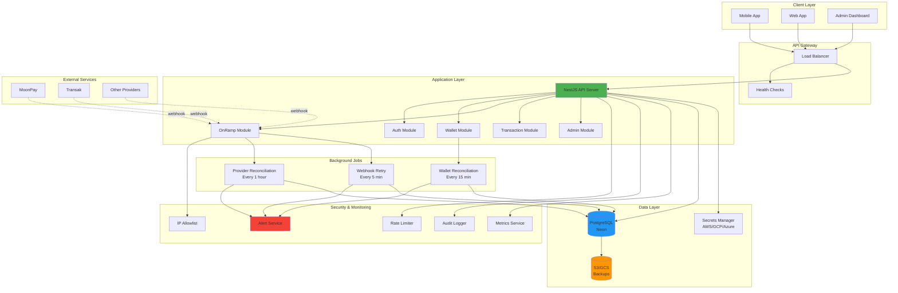
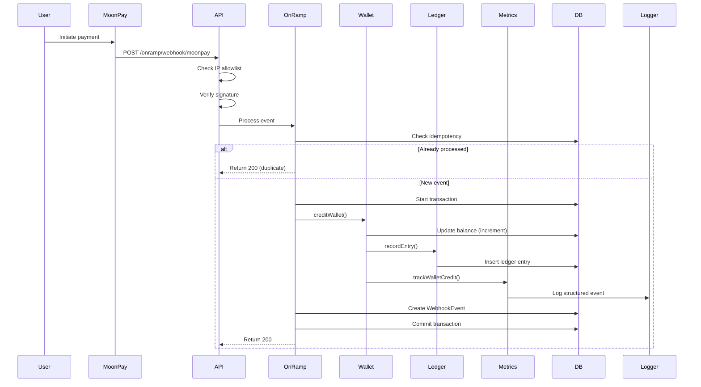
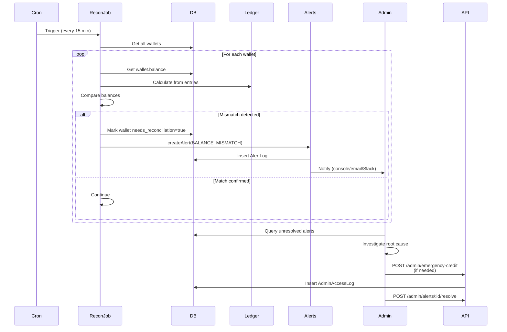
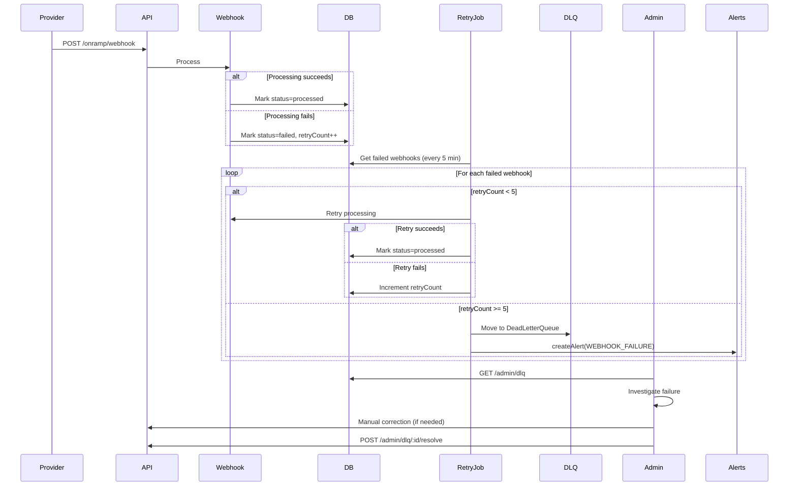

# System Architecture

## Overview

Production-grade cryptocurrency wallet platform with **detect-first, fix-second** philosophy. The system prioritizes data integrity, auditability, and human oversight over automated corrections.

## High-Level Architecture



## Core Principles

### 1. Detect-First, Fix-Second

### 2. Immutable Ledger

### 3. Human-in-the-Loop

### 4. Defense in Depth

## Data Integrity Patterns

### Idempotency Keys

**Purpose**: Prevent duplicate operations from webhook retries, network failures, or concurrent requests.

**Implementation**:
- Every wallet operation (credit/debit) generates a unique idempotency key
- Key format: `{source}:{reference}:{walletId}:{action}`
- Stored in `WalletLedgerEntry.idempotencyKey` with unique constraint
- Duplicate operations return existing wallet state (no error, no re-execution)

**Key Generation**:
```typescript
// Webhook-triggered credit
webhook:moonpay_tx_12345:wallet_abc:credit

// User-initiated withdrawal
user:user_789_tx_456:wallet_abc:debit

// Admin manual credit
admin:admin_123_1707350400000:wallet_abc:credit
```

**Behavior**:
1. Before processing, check if idempotency key exists
2. If exists: Return existing wallet state (idempotent)
3. If new: Proceed with operation

**Benefits**:
- Safe webhook retries (providers often retry on timeout)
- Network failure resilience (client can safely retry)
- Audit trail (idempotency key in ledger entry)

### Concurrency Control

**Purpose**: Prevent race condition balance corruption when multiple operations target the same wallet simultaneously.

**Implementation**:
- PostgreSQL row-level locking: `SELECT ... FOR UPDATE`
- Lock acquired within transaction before balance check/update
- Lock automatically released on transaction commit/rollback
- Configurable lock timeout (default 5000ms)

**Usage Pattern**:
```typescript
await prisma.$transaction(async (tx) => {
  // Acquire lock first
  const lockedWallet = await concurrencyLockService.lockWallet(tx, walletId);
  
  // Now safe to check balance
  if (lockedWallet.balance < amount) {
    throw new BadRequestException('Insufficient balance');
  }
  
  // Update balance
  await tx.wallet.update({
    where: { id: walletId },
    data: { balance: { increment: amount } }
  });
});
```

**Deadlock Prevention**:
- Multi-wallet operations lock in sorted order (by wallet ID)
- Example: Transfer from wallet_B to wallet_A always locks [wallet_A, wallet_B]

**Benefits**:
- Prevents lost updates (concurrent credit/debit)
- Accurate balance checks (no TOCTOU bugs)
- Database-level consistency guarantee

### Ledger Reconciliation

**Purpose**: Detect and optionally fix balance discrepancies between wallet.balance and ledger entries.

**Implementation**:
- CLI tool: `npm run reconcile:balance`
- Reads all ledger entries for a wallet
- Recalculates balance chronologically
- Compares to `wallet.balance` field

**Usage**:
```bash
# Check all wallets (read-only)
npm run reconcile:balance

# Check specific wallet
npm run reconcile:balance wallet_abc

# Fix discrepancies (interactive confirmation)
npm run reconcile:balance --fix

# Fix without confirmation (use in automated scripts)
npm run reconcile:balance --fix --force
```

**Output**:
```
┌──────────┬─────────────┬────────────┬─────────────┬────────┐
│ Wallet   │ Current Bal │ Ledger Bal │ Discrepancy │ Status │
├──────────┼─────────────┼────────────┼─────────────┼────────┤
│ wallet_1 │ 1000        │ 1000       │ 0           │ ✓ OK   │
│ wallet_2 │ 500         │ 550        │ -50         │ ✗ WARN │
└──────────┴─────────────┴────────────┴─────────────┴────────┘
```

**Safety Features**:
- Read-only by default (requires `--fix` flag)
- Interactive confirmation in production (unless `--force`)
- Validates ledger integrity before fixing (no gaps in timestamps)
- Logs all corrections to audit trail

**Integration**:
- Can be run manually or scheduled as cron job
- Recommended: Daily in staging, weekly in production

## Data Flow

### Wallet Credit Flow (Deposit)



### Reconciliation Flow



### Webhook Retry Flow



## Database Schema

### Core Tables

```sql
-- User authentication
User (id, email, password, role, createdAt)

-- Wallet storage (fast balance reads)
Wallet (id, userId, balance, currency, frozenAt, needsReconciliation, createdAt)

-- Immutable ledger (source of truth)
WalletLedgerEntry (
  id, walletId, type, amount, 
  balanceBefore, balanceAfter,
  source, providerEventId, reference, description,
  createdAt
)

-- Transaction records
Transaction (id, walletId, type, amount, status, createdAt)

-- On-ramp tracking
OnRamp (id, walletId, provider, amount, currency, status, createdAt)

-- Webhook idempotency
WebhookEvent (
  id, provider, externalId, payloadHash,
  status, transactionId, retryCount, lastAttemptAt, processedAt
)

-- Human review queue
DeadLetterQueue (
  id, provider, externalId, payload, failureReason,
  attempts, resolved, resolvedBy, resolutionNotes, createdAt
)

-- Alert tracking
AlertLog (
  id, alertType, severity, title, metadata,
  resolved, resolvedAt, resolution, createdAt
)

-- Admin audit trail
AdminAccessLog (
  id, adminId, action, targetUserId, targetWalletId,
  metadata, ipAddress, createdAt
)
```

### Data Integrity Rules

1. **Wallet.balance** - Fast read, periodically reconciled
2. **WalletLedgerEntry** - Source of truth, immutable
3. **Reconciliation Job** - Validates Wallet.balance = SUM(WalletLedgerEntry)
4. **WebhookEvent.externalId** - Unique constraint ensures idempotency
5. **AdminAccessLog** - All admin actions logged, cannot be deleted

## Module Architecture

### Auth Module
- JWT-based authentication
- Refresh token rotation
- Role-based access control (USER, ADMIN)
- Rate limiting: 5 req/min

### Wallet Module
- `WalletService` - Core balance operations
- `WalletLedgerService` - Immutable ledger management
- `WalletController` - REST API endpoints
- Rate limiting: 10 req/min (writes), 30 req/min (reads)

### OnRamp Module
- `OnRampService` - Fiat → crypto processing
- `OnRampController` - Webhook endpoints
- `MoonPayParser` - Provider-specific parsing
- `OnRampStatusGuard` - Status validation
- `WebhookIPGuard` - IP allowlist enforcement
- Rate limiting: None (IP + signature gated)

### Transaction Module
- `TransactionService` - Transaction history
- `TransactionController` - Query endpoints
- Rate limiting: 20 req/min

### Admin Module
- `AdminService` - Emergency operations
- `AlertsService` - Alert generation and management
- `DeadLetterQueueService` - Failed event handling
- `AdminAccessLogger` - Audit trail
- Rate limiting: 2 req/min (emergency), 100 req/min (reads)

### Common Modules
- `LoggingModule` - Structured audit logging
- `MetricsModule` - Operational metrics
- `RateLimitModule` - Per-endpoint rate limits
- `PrismaModule` - Database access

## Security Architecture

### Authentication & Authorization
```
User Request
  ↓
[JWT Auth Guard] - Validates token
  ↓
[Role Guard] - Checks user.role === 'ADMIN'
  ↓
[Rate Limit Guard] - Enforces request limits
  ↓
Controller Handler
```

### Webhook Security
```
Provider Request
  ↓
[IP Allowlist Guard] - Checks WEBHOOK_ALLOWED_IPS
  ↓
[Signature Verification] - Validates HMAC signature
  ↓
[Idempotency Check] - Prevents duplicate processing
  ↓
Webhook Handler
```

### Admin Access
```
Admin Request
  ↓
[JWT Auth Guard] - Validates token
  ↓
[Role Guard] - Requires role='ADMIN'
  ↓
[Rate Limit Guard] - 2 req/min for emergency actions
  ↓
[Admin Access Logger] - Logs to AdminAccessLog
  ↓
Admin Handler
```

## Monitoring & Alerting

### Metrics Collected

**Wallet Operations:**
- `wallet_operation.credit` - Amount, success rate, duration
- `wallet_operation.debit` - Amount, success rate, duration
- `wallet_operation.balance_check` - Frequency, duration

**Webhook Processing:**
- `webhook_processing.success` - By provider, duration
- `webhook_processing.failed` - By provider, error reason
- `webhook_processing.retry` - Retry count, success rate
- `webhook_processing.dlq` - Events moved to DLQ

**Alert Types:**
1. **BALANCE_MISMATCH** (Critical) - Wallet.balance ≠ Ledger sum
2. **WEBHOOK_FAILURE** (High) - Webhook failed 5+ times
3. **JOB_CRASH** (Critical) - Reconciliation job crashed
4. **CREDIT_SPIKE** (Medium) - Unusual credit volume

### Log Format

**Structured JSON (Production):**
```json
{
  "type": "METRIC",
  "metric": "wallet_operation",
  "operation": "credit",
  "success": true,
  "amount": 100.00,
  "currency": "USD",
  "durationMs": 45,
  "timestamp": "2026-02-07T10:00:00.000Z"
}
```

**Audit Log (All Environments):**
```
2026-02-07T10:00:00.000Z [AUDIT] [req:abc123 | user:user_456 | wallet:wallet_789] Wallet credited (deposit) | {"amount":100,"currency":"USD","balanceBefore":900.50,"balanceAfter":1000.50}
```

## Deployment Architecture

### Production Environment

```
┌─────────────────────────────────────────┐
│          Load Balancer (HTTPS)          │
│         - SSL Termination                │
│         - Health checks: /health         │
│         - Readiness: /ready              │
└─────────────────────────────────────────┘
                  │
     ┌────────────┴────────────┐
     │                         │
┌─────────┐              ┌─────────┐
│ API #1  │              │ API #2  │
│ Port    │              │ Port    │
│ 3000    │              │ 3000    │
└─────────┘              └─────────┘
     │                         │
     └────────────┬────────────┘
                  │
     ┌────────────────────────┐
     │  PostgreSQL (Neon)     │
     │  - SSL required        │
     │  - Connection pool ≤100│
     │  - Backups: Daily      │
     └────────────────────────┘
```

### Environment Variables

**Required (Fail-Fast):**
- `NODE_ENV` - development | staging | production
- `DATABASE_URL` - PostgreSQL connection string
- `JWT_SECRET` - JWT signing secret
- `JWT_REFRESH_SECRET` - Refresh token secret
- `MOONPAY_WEBHOOK_SECRET` - MoonPay signature verification
- `CORS_ALLOWED_ORIGINS` - Comma-separated (production only)

**Optional (With Defaults):**
- `PORT` - API port (default: 3000)
- `WEBHOOK_ALLOWED_IPS` - IP allowlist (default: all in dev)
- `JWT_SECRET_ROTATION_DATE` - Secret rotation tracking
- `DATABASE_PASSWORD_ROTATION_DATE` - Password rotation tracking

### Startup Sequence

1. **Environment Validation** - Fail-fast if required vars missing
2. **Database Connection** - Test connection, fail if unreachable
3. **Migration Check** - Warn if pending migrations (production)
4. **Secrets Validation** - Check rotation dates, warn if >60 days
5. **Service Initialization** - Start all modules
6. **Readiness Check** - `/ready` returns 200 when all checks pass
7. **Accept Traffic** - Load balancer routes traffic

### Health Checks

**Liveness (Kubernetes):**
```yaml
livenessProbe:
  httpGet:
    path: /health
    port: 3000
  initialDelaySeconds: 30
  periodSeconds: 10
```

**Readiness (Kubernetes):**
```yaml
readinessProbe:
  httpGet:
    path: /ready
    port: 3000
  initialDelaySeconds: 5
  periodSeconds: 5
```

## Scaling Considerations

### Horizontal Scaling
- ✅ Stateless API servers (JWT auth)
- ✅ Database connection pooling
- ✅ Background jobs use distributed locks (planned)
- ⚠️  Rate limiting currently in-memory (Redis recommended for multi-instance)

### Database Optimization
- **Indexes:** userId, walletId, externalId, status, createdAt
- **Partitioning:** Ledger entries by month (planned)
- **Archival:** Ledger entries >1 year to cold storage (planned)

### Performance Targets
- p50 latency: <50ms
- p95 latency: <200ms
- p99 latency: <500ms
- Wallet credit: <100ms
- Reconciliation: <5 minutes (all wallets)

## Disaster Recovery

### Backup Strategy
- **Frequency:** Daily automated backups
- **Retention:** 30 days hot, 90 days cold
- **Testing:** Restore test every 90 days (automated)
- **Location:** S3/GCS with encryption

### Recovery Procedures
1. **Database Failure:** Restore from latest backup (<1 hour)
2. **Balance Mismatch:** Reconciliation job alerts, admin resolves
3. **Webhook Failure:** Retry job + DLQ (human review)
4. **Secret Compromise:** Rotation procedures in SECRETS_AND_ACCESS_CONTROL.md

## Documentation

- [API Reference](./API_REFERENCE.md) - Complete API documentation
- [Database Safety](./DATABASE_SAFETY.md) - Migration and backup guide
- [Secrets Management](./SECRETS_AND_ACCESS_CONTROL.md) - Security guide
- [Rate Limiting](./RATE_LIMITING.md) - Abuse protection
- [Database Operations](./DATABASE_OPERATIONS.md) - Daily operations

## Technology Stack

- **Runtime:** Node.js 18+
- **Framework:** NestJS 10
- **Database:** PostgreSQL 15 (Neon)
- **ORM:** Prisma 5
- **Authentication:** JWT (jsonwebtoken)
- **Testing:** Jest
- **TypeScript:** 5.1+
- **Deployment:** Docker + Kubernetes (recommended)

## Future Enhancements (v2)

- Email/Slack alert integration
- Real-time dashboard (WebSocket)
- Multi-currency support
- Withdrawal processing
- Trading functionality
- Redis for distributed rate limiting
- TimescaleDB for metrics storage
- AWS Secrets Manager / GCP Secret Manager integration
