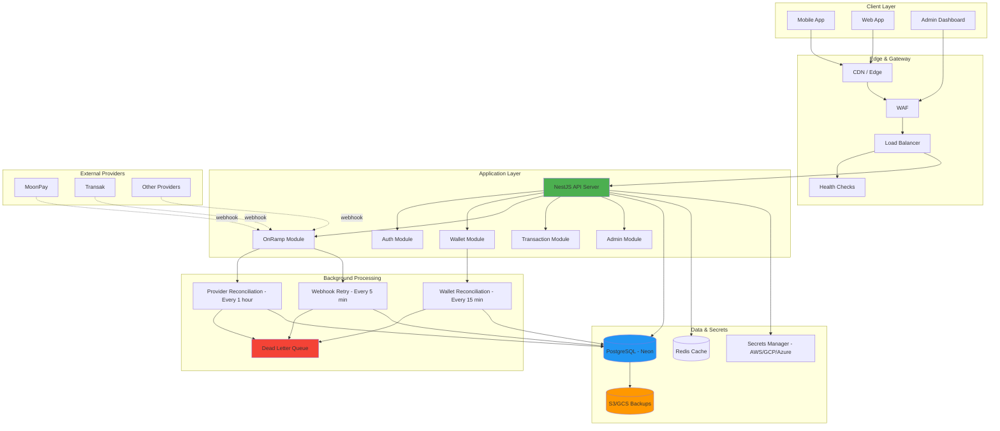
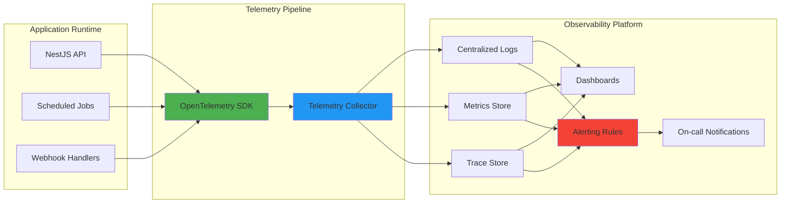

# Architecture

Enterprise architecture for the crypto wallet platform.

## System Architecture

```mermaid
graph TB
    subgraph "Client Layer"
        Mobile[Mobile App]
        Web[Web App]
        Admin[Admin Dashboard]
    end

    subgraph "Edge & Gateway"
        CDN[CDN / Edge]
        WAF[WAF]
        LB[Load Balancer]
        Health[Health Checks]
    end

    subgraph "Application Layer"
        API[NestJS API Server]
        Auth[Auth Module]
        Wallet[Wallet Module]
        OnRamp[OnRamp Module]
        Transaction[Transaction Module]
        AdminMod[Admin Module]
    end

    subgraph "Background Processing"
        ReconcileWallet[Wallet Reconciliation - Every 15 min]
        ReconcileProvider[Provider Reconciliation - Every 1 hour]
        WebhookRetry[Webhook Retry - Every 5 min]
        DLQ[Dead Letter Queue]
    end

    subgraph "Data & Secrets"
        DB[(PostgreSQL - Neon)]
        Cache[(Redis Cache)]
        Backup[(S3/GCS Backups)]
        Secrets[Secrets Manager - AWS/GCP/Azure]
    end

    subgraph "External Providers"
        MoonPay[MoonPay]
        Transak[Transak]
        OtherProviders[Other Providers]
    end

    Mobile --> CDN --> WAF --> LB
    Web --> CDN
    Admin --> WAF

    LB --> Health
    LB --> API

    API --> Auth
    API --> Wallet
    API --> OnRamp
    API --> Transaction
    API --> AdminMod

    Wallet --> ReconcileWallet
    OnRamp --> ReconcileProvider
    OnRamp --> WebhookRetry

    ReconcileWallet --> DLQ
    ReconcileProvider --> DLQ
    WebhookRetry --> DLQ

    API --> DB
    API --> Cache
    ReconcileWallet --> DB
    ReconcileProvider --> DB
    WebhookRetry --> DB

    DB --> Backup
    API --> Secrets

    MoonPay -. webhook .-> OnRamp
    Transak -. webhook .-> OnRamp
    OtherProviders -. webhook .-> OnRamp

    style API fill:#4CAF50
    style DB fill:#2196F3
    style Backup fill:#FF9800
    style DLQ fill:#f44336
```

## Monitoring & Observability Architecture

```mermaid
graph LR
    subgraph "Application Runtime"
        API[NestJS API]
        Jobs[Scheduled Jobs]
        Webhooks[Webhook Handlers]
    end

    subgraph "Telemetry Pipeline"
        OTel[OpenTelemetry SDK]
        Collector[Telemetry Collector]
    end

    subgraph "Observability Platform"
        Logs[Centralized Logs]
        Metrics[Metrics Store]
        Traces[Trace Store]
        Dashboards[Dashboards]
        Alerts[Alerting Rules]
        Pager[On-call Notifications]
    end

    API --> OTel
    Jobs --> OTel
    Webhooks --> OTel

    OTel --> Collector
    Collector --> Logs
    Collector --> Metrics
    Collector --> Traces

    Logs --> Dashboards
    Metrics --> Dashboards
    Traces --> Dashboards

    Metrics --> Alerts
    Logs --> Alerts
    Traces --> Alerts
    Alerts --> Pager

    style OTel fill:#4CAF50
    style Collector fill:#2196F3
    style Alerts fill:#f44336
```
