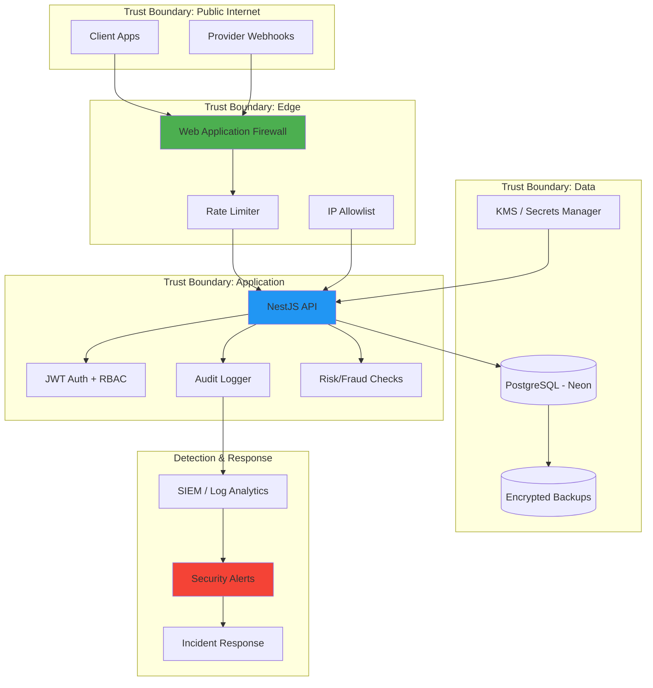

# Security

Security architecture and control boundaries for the platform.

## Security Architecture Diagram

## Security Controls

- Enforce JWT authentication and role-based access control for protected routes.
- Restrict webhook endpoints using IP allowlists and signature verification.
- Store secrets in a managed secrets system; never hardcode credentials.
- Enable audit logging for admin actions and sensitive transaction flows.
- Encrypt data at rest and in transit; verify backup encryption policies.
